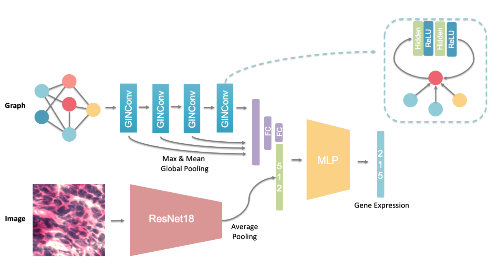
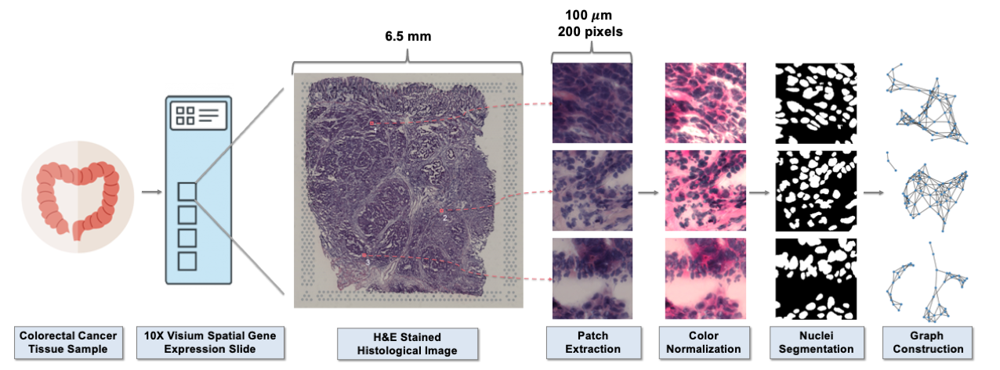

## IGI-DL

Source code for Integrated Graph and Image Deep Learning (IGI-DL).

<!-- <p align="center">
     <br />
    <em> The schematics of the designed IGI-DL model</em>
</p> -->


### Data structure

10X Visium spatial transcriptomics data with high-resolution HE-stained histological images are saved in **./dataset**

```bash
dataset
└───sample1
│  └───HE_image
│    │  histology.jpg
│
│  └───filtered_feature_bc_matrix
│    │  barcodes.tsv.gz
│    │  features.tsv.gz
│    │  matrix.mtx.gz
│ 
│  └───spatial
│    │  aligned_fiducials.jpg
│    │  detected_tissue_image.jpg
│    │  scalefactors_json.json
│    │  tissue_hires_image.png
│    │  tissue_lowres_image.png
│    │  tissue_positions_list.csv
│ 
└───sample2
│  ...
```

**HE/** containes a high-resolution brightfield image stained with hematoxylin and eosin (H&E), which is before Space Ranger downsampling.

**filtered_feature_bc_matrix/** and  **spatial/** are the outputs of Space Ranger.
filtered_feature_bc_matrix: Feature barcode matrices that contains only tissue-associated barcodes.
spatial: Folder containing Visium-specific outs (QC images to check image processing pipeline, downsampled input images, and files that describe spot barcode locations in the images)

Preprocessed HE patches and constructed Nuclei-Graphs are saved in **./preprocessed_data**, where **./preprocessed_data/HE_patches** contains HE patches extracted according to the coordinates of the spot, **./preprocessed_data/HE_patches** containes patches after color normalization, **./preprocessed_data/hover_seg** containes patches after color normalization

```bash
preprocessed_data
└───HE_patches
│  └───sample1
│    │  ...
│  └───sample2
│    │  ...
│  └───sample3
│    │  ...
│
└───HE_nmzd
│  └───sample1
│    │  ...
│
└───hover_seg
│  └───sample1
│    │  ...
│
└───nuclei_seg_features
│  └───sample1
│    │  ...
│
└───nuclei_standar_features
│  └───sample1
│    │  ...
│
└───y_label_df
│  └───sample1
│    │  ...
│
└───graph_image_pt
│  └───sample1
│    │  ...
```

### Data preprocessing
Code in **./preprocessing**

<p align="center">
     <br />
    <em> The flowchart of data preprocessing</em>
</p>

##### 1. HE patches extraction

```bash
cd preprocessing
python patches_extract.py
```

##### 2. HE patches color normalization

```bash
cd preprocessing
python patches_normalization.py
```

##### 3. Nuclei segmentation

Using Hover-Nety<sup>[1]</sup> pretrained on PanNuke Datasety<sup>[2]</sup> to segment nucleus in the HE patches, where the model weight file is saved in **./Hover-Net/hovernet-inference-weights** as pannuke.npz.

```bash
mkdir Hover-Net
cd Hover-Net
git clone https://github.com/simongraham/hovernet_inference.git

python hovernet_inference/run.py \
--mode='tile' \
--model='./hovernet-inference-weights/pannuke.npz' \
--input_dir='../../preprocessed_data/HE_nmzd/sample1' \
--output_dir='../../preprocessed_data/hover_seg/sample1'

python hovernet_inference/run.py \
--mode='tile' \
--model='./hovernet-inference-weights/pannuke.npz' \
--input_dir='../../preprocessed_data/HE_nmzd/sample2' \
--output_dir='../../preprocessed_data/hover_seg/sample2'
```

##### 4. Nuclei features extraction

```bash
cd preprocessing
python nuclei_features_extract.py
```

##### 5. Nuclei features standardization

```bash
cd preprocessing
python nuclei_features_standardization.py
```

##### 6. Gene expression transformation

```bash
cd preprocessing
python gene_count_transform.py
```

##### 7. Nuclei-Graphs construction

```bash
cd preprocessing
python graph_construct.py
```

### Model training
Code in **./model_training**

##### Image-based models

- ResNet18
```bash
cd model_training/image_based
python resnet18_MLP_Y_main.py img_resnet18 2e-4 1e-4 300 30 --mlp_hidden 512 256 256
```

- ViT
```bash
cd model_training/image_based
python ViT_MLP_Y_main.py img_ViT 2e-4 1e-4 300 30 8 64 256 --mlp_hidden 512 256 256
```

##### Graph-based models

- GIN
```bash
cd model_training/graph_based
python gin4layer_multi_Y_main.py graph_GIN 2e-4 1e-4 256 300 30
```

- GCN
```bash
cd model_training/graph_based
python gcn4layer_multi_Y_main.py graph_GCN 2e-4 1e-4 256 300 30
```

- GAT
```bash
cd model_training/graph_based
python gat4layer_multi_Y_main.py graph_GAT 2e-4 1e-4 256 300 30
```

##### Integrated models

- GIN+ResNet18
```bash
cd model_training/integrated_model
python GIN_Res18_main.py integrated_GIN_resnet 2e-4 1e-4 256 300 30 --mlp_hidden 512 256 256
```

- GCN+ResNet18
```bash
cd model_training/integrated_model
python GCN_Res18_main.py integrated_GCN_resnet 2e-4 1e-4 256 300 30 --mlp_hidden 512 256 256
```

- GAT+ResNet18
```bash
cd model_training/integrated_model
python GAT_Res18_main.py integrated_GCN_resnet 2e-4 1e-4 256 300 30 --mlp_hidden 512 256 256
```

- GIN+ViT
```bash
cd model_training/integrated_model
python GIN_ViT_MLP_main.py integrated_GIN_ViT 2e-4 1e-4 256 300 30 8 64 256 256 --mlp_hidden 512 256 256
```
### IGI-DL prediction
Code in **./model_prediction**

##### Saving model weights
Model weights are saved as **./IGI-DL-weights.pth**
```bash
cd model_prediction
python IGI_training_main.py False 2e-4 1e-4 128 0.4 100 10 --mlp_hidden 256 256
```

##### Predicting new samples
```bash
cd model_prediction
python IGI_test_main.py
```


### Reference

[1] Graham S, Vu Q D, Raza S E A, et al. Hover-net: Simultaneous segmentation and classification of nuclei in multi-tissue histology images[J]. Medical Image Analysis, 2019, 58: 101563.

[2] Gamper J, Alemi Koohbanani N, Benet K, et al. Pannuke: an open pan-cancer histology dataset for nuclei instance segmentation and classification[C]//European congress on digital pathology. Springer, Cham, 2019: 11-19.