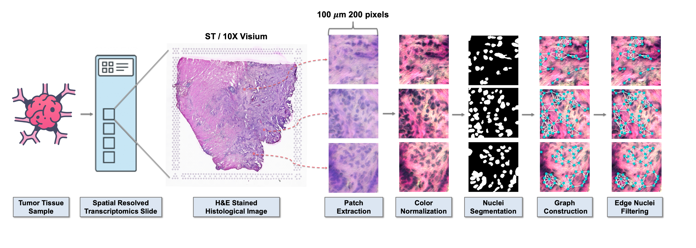
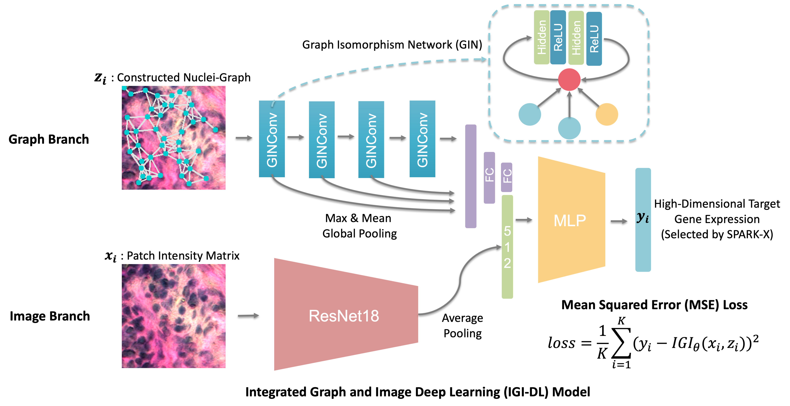

## ST_IGI package
A python package called "ST_IGI", which is an integrated graph and image deep learning model for gene spatial expression prediction based on HE slides of cancer.

### Install ST_IGI package
```bash
install ST_IGI-0.2.0.tar.gz
```
### System requirement
Major dependencies are:
- python 3.9
- torch 1.11.0+cu102
- torchvision 0.12.0+cu102
- torch-cluster 1.6.0
- torch-scatter 2.0.9
- torch-sparse 0.6.15
- torch-geometric 2.1.0.post1
- opencv-python
- matplotlib
- pandas
- palettable

### Model weights
The model weights trained on three cancer types, cutaneous squamous cell carcinoma (cSCC), breast cancer,  and colorectal cancer (CRC), are saved in **./model_weights**.

### Demo data
Demo data can be downloaded on the [Zenodo](https://zenodo.org/records/10613039), including a cSCC sample sequenced by 10X Visium and a breast cancer sample sequenced by ST. Downloaded demo data can be saved in **./download_data**.

### Demo example
The usage example of this Python package is shown in the **ST_IGI_demo.ipynb**. When calling some functions of ST_IGI, it will automatically download the model weights and demo data. If it fails to download due to network reasons, you can download the relevant files yourself by referring to the contents of the two sections above, **Model weights** and **Demo data**.

## Source code

### Data structure

10X Visium spatial transcriptomics data with high-resolution HE-stained histological images are saved in **./dataset**.

```bash
dataset
└───sample1
│  └───HE_image
│    │  histology.jpg
│
│  └───filtered_feature_bc_matrix
│    │  barcodes.tsv.gz
│    │  features.tsv.gz
│    │  matrix.mtx.gz
│ 
│  └───spatial
│    │  aligned_fiducials.jpg
│    │  detected_tissue_image.jpg
│    │  scalefactors_json.json
│    │  tissue_hires_image.png
│    │  tissue_lowres_image.png
│    │  tissue_positions_list.csv
│ 
└───sample2
│  ...
```

**HE/** containes a high-resolution brightfield image stained with hematoxylin and eosin (H&E), which is before Space Ranger downsampling.

**filtered_feature_bc_matrix/** and  **spatial/** are the outputs of Space Ranger.
filtered_feature_bc_matrix: Feature barcode matrices that contains only tissue-associated barcodes.
spatial: Folder containing Visium-specific outs (QC images to check image processing pipeline, downsampled input images, and files that describe spot barcode locations in the images)

Preprocessed HE patches and constructed Nuclei-Graphs are saved in **./preprocessed_data**, where **HE_patches** contains HE patches extracted according to the coordinates of the spot, **HE_nmzd** containes patches after color normalization, **hover_seg** containes segmented nuclei in patches, **nuclei_seg_features** containes extracted nuclei features, **nuclei_standar_features** containes standardized nuclei features, **SVGs_label** containes transformed expression level for target genes, and **graph_image_pt** containes constructed Nuclei-Graphs.

```bash
preprocessed_data
└───HE_patches
│  └───sample1
│    │  ...
│  └───sample2
│    │  ...
│  └───sample3
│    │  ...
│
└───HE_nmzd
│  └───sample1
│    │  ...
│
└───hover_seg
│  └───sample1
│    │  ...
│
└───nuclei_seg_features
│  └───sample1
│    │  ...
│
└───filtered_nuclei_seg_features
│  └───sample1
│    │  ...
│
└───filtered_nuclei_standar_features
│  └───sample1
│    │  ...
│
└───SVGs_label
│  └───sample1
│    │  ...
│
└───filtered_graph_SVGs
│  └───sample1
│    │  ...
```

### Data preprocessing
<p align="center">
     <br />
    <em>Data preprocessing workflow</em>
</p>

Code in **./preprocessing**

##### 1. Image preprocessing
###### 1.1 HE patches extraction

```bash
cd preprocessing
python patches_extract.py
```

###### 1.2 HE patches color normalization

```bash
cd preprocessing
python patches_normalization.py
```
Normalized HE patches are saved in **./preprocessed_data/HE_nmzd**.

###### 1.3 Nuclei segmentation

Using Hover-Net<sup>[1]</sup> pretrained on PanNuke Dataset<sup>[2]</sup> to segment nucleus in the HE patches, where the model weight file is saved in **./Hover-Net/hovernet-inference-weights** as pannuke.npz.

```bash
cd preprocessing
mkdir Hover-Net
cd Hover-Net
git clone https://github.com/simongraham/hovernet_inference.git

python hovernet_inference/run.py \
--mode='tile' \
--model='./hovernet-inference-weights/pannuke.npz' \
--input_dir='../../preprocessed_data/HE_nmzd/sample1' \
--output_dir='../../preprocessed_data/hover_seg/sample1'

python hovernet_inference/run.py \
--mode='tile' \
--model='./hovernet-inference-weights/pannuke.npz' \
--input_dir='../../preprocessed_data/HE_nmzd/sample2' \
--output_dir='../../preprocessed_data/hover_seg/sample2'
```

###### 1.4 Nuclei features extraction

```bash
cd preprocessing
python nuclei_features_extract.py
```

###### 1.5 Edge nuclei filtering

```bash
cd preprocessing
python nuclei_edge_filter.py
```

###### 1.6 Nuclei features standardization

```bash
cd preprocessing
python nuclei_features_standardization.py
```

Standardized nuclei features for each patch are saves in **./preprocessed_data/filtered_nuclei_standar_features**.

###### 1.7 Nuclei features selection

Nuclei features selection was conducted employing a correlation filter based on the absolute values of pairwise Spearman's correlation coefficient ($\rho$) to mitigate feature redundancy. The threshold for $\rho$ was set at 0.9. If two features exhibited a $\rho$ > 0.9, the approach assessed the mean absolute correlation of each variable, and the variable with the highest mean absolute correlation was excluded.

```bash
cd preprocessing/nuclei_features_selection
python nuclei_features_corr_selection.py
```
Removed nuclei features for each cancer type are saves in **./preprocessing/nuclei_features_selection**. 
The union of removed features from CRC, breast cancer and cSCC was computed for the subsequent construction of the Nuclei-graph.

```bash
cd preprocessing/nuclei_features_selection
python nuclei_common_selected_features.py
```
The union list was saves as  **./preprocessing/nuclei_features_selection/removed_feature_union.txt**

##### 2. Gene expression preprocessing
###### 2.1 Find SVGs using SPARKX<sup>[3]</sup>

```bash
cd preprocessing
Rscript SPARKX_SVGs.r
```
SVGs for each tissue sample are saved in **./preprocessed_data/SVG_top2000**.

###### 2.2 Target genes selection

```bash
cd preprocessing
python target_genes_selection.py
```
Target genes list is saved in **SVGs_SPARKX.txt** .

###### 2.3 Count data transformation

```bash
cd preprocessing
python gene_count_tranform.py
```
Transformed count data for each tissue sample are saved in **./preprocessed_data/SVGs_label**.

##### 3. Nuclei-Graphs construction

```bash
cd preprocessing
python graph_construct.py
```

Constructed Nuclei-Graphs for patches in each tissue sample are saved in **./preprocessed_data/filtered_graph_SVGs**.

### IGI-DL and comparison models training
<p align="center">
     <br />
    <em> The architecture of our designed IGI-DL model</em>
</p>

Code in **./model_training**

##### Image-based models

- ResNet18
```bash
cd model_training/image_based
python resnet18_MLP_Y_main.py img_resnet18 2e-4 1e-4 300 30 --mlp_hidden 512 256 256
```
The first argument ('img_resnet18') represents the name of the trained model, the second argument (2e-4) represents the learning rate, the third argument (1e-4) represents the weight decay, the fourth argument (300) represents the number of epochs, the fifth argument (30) represents the number of patience, and the last argument (--mlp_hidden 512 256 256) represents the dimension of MLP hidden layers.

- ViT
```bash
cd model_training/image_based
python ViT_MLP_Y_main.py img_ViT 2e-4 1e-4 300 30 8 64 256 --mlp_hidden 512 256 256
```
The first argument ('img_ViT') represents the name of the trained model, the second argument (2e-4) represents the learning rate, the third argument (1e-4) represents the weight decay, the fourth argument (300) represents the number of epochs, the fifth argument (30) represents the number of patience, the sixth argument (8) represents the attention heads number, the seventh argument (64) represents the dimension of head, the eighth argument (256) represents the dimension of hidden features, and the last argument (--mlp_hidden 512 256 256) represents the dimension of MLP hidden layers.

##### Graph-based models

- GIN
```bash
cd model_training/graph_based
python gin4layer_multi_Y_main.py graph_GIN 2e-4 1e-4 256 300 30
```
The first argument ('graph_GIN') represents the name of the trained model, the second argument (2e-4) represents the learning rate, the third argument (1e-4) represents the weight decay, the fourth argument (300) represents the number of epochs, and the fifth argument (30) represents the number of patience.

- GCN
```bash
cd model_training/graph_based
python gcn4layer_multi_Y_main.py graph_GCN 2e-4 1e-4 256 300 30
```
The first argument ('graph_GCN') represents the name of the trained model, the second argument (2e-4) represents the learning rate, the third argument (1e-4) represents the weight decay, the fourth argument (300) represents the number of epochs, and the fifth argument (30) represents the number of patience.

- GAT
```bash
cd model_training/graph_based
python gat4layer_multi_Y_main.py graph_GAT 2e-4 1e-4 256 300 30
```
The first argument ('graph_GAT') represents the name of the trained model, the second argument (2e-4) represents the learning rate, the third argument (1e-4) represents the weight decay, the fourth argument (300) represents the number of epochs, and the fifth argument (30) represents the number of patience.

##### Integrated models
- GIN+ResNet18
```bash
cd model_training/integrated_model
python GIN_Res18_main.py integrated_GIN_resnet 2e-4 1e-4 256 300 30 --mlp_hidden 512 256 256
```
The first argument ('integrated_GIN_resnet') represents the name of the trained model, the second argument (2e-4) represents the learning rate, the third argument (1e-4) represents the weight decay, the fourth argument (256) represents the dimension of the GIN hidden layer, the fifth argument (300) represents the number of epochs, the sixth argument (30) represents the number of patience, and the last argument (--mlp_hidden 512 256 256) represents the dimension of MLP hidden layers.

- GCN+ResNet18
```bash
cd model_training/integrated_model
python GCN_Res18_main.py integrated_GCN_resnet 2e-4 1e-4 256 300 30 --mlp_hidden 512 256 256
```
The first argument ('integrated_GCN_resnet') represents the name of the trained model, the second argument (2e-4) represents the learning rate, the third argument (1e-4) represents the weight decay, the fourth argument (256) represents the dimension of the GCN hidden layer, the fifth argument (300) represents the number of epochs, the sixth argument (30) represents the number of patience, and the last argument (--mlp_hidden 512 256 256) represents the dimension of MLP hidden layers.

- GAT+ResNet18
```bash
cd model_training/integrated_model
python GAT_Res18_main.py integrated_GAT_resnet 2e-4 1e-4 256 300 30 --mlp_hidden 512 256 256
```
The first argument ('integrated_GAT_resnet') represents the name of the trained model, the second argument (2e-4) represents the learning rate, the third argument (1e-4) represents the weight decay, the fourth argument (256) represents the dimension of the GAT hidden layer, the fifth argument (300) represents the number of epochs, the sixth argument (30) represents the number of patience, and the last argument (--mlp_hidden 512 256 256) represents the dimension of MLP hidden layers.

- GIN+ViT
```bash
cd model_training/integrated_model
python GIN_ViT_MLP_main.py integrated_GIN_ViT 2e-4 1e-4 256 300 30 8 64 256 256 --mlp_hidden 512 256 256
```
The first argument ('integrated_GIN_ViT') represents the name of the trained model, the second argument (2e-4) represents the learning rate, the third argument (1e-4) represents the weight decay, the fourth argument (256) represents the dimension of the GIN hidden layer, the fifth argument (300) represents the number of epochs, the sixth argument (30) represents the number of patience, the seventh argument (8) represents the attention heads number in ViT, the eighth argument (64) represents the dimension of head in ViT, the ninth argument (256) represents the dimension of hidden features in ViT, the tenth argument (256) represents the dimension of out features in ViT, and the last argument (--mlp_hidden 512 256 256) represents the dimension of MLP hidden layers.

### IGI-DL prediction
Code in **./model_prediction**

##### Saving model weights
Model weights are saved as **./IGI-DL-weights.pth**
```bash
cd model_prediction
python IGI_training_main.py 2e-4 1e-4 256 300 30 --mlp_hidden 512 256 256
```
The first argument (2e-4) represents the learning rate, the second argument (1e-4) represents the weight decay, the third argument (256) represents the dimension of the GIN hidden layer, the fourth argument (300) represents the number of epochs, the fifth argument (30) represents the number of patience, and the last argument (--mlp_hidden 512 256 256) represents the dimension of MLP hidden layers.

##### Predicting new samples
```bash
cd model_prediction
python IGI_test_main.py
```
### Graph-based survival model
<p align="center">
     <br />
    <em> The architecture of our graph-based survival model </em>
</p>

#### Super-patch graph construction for HE-stained WSI
##### 1. WSI preprocessing
Code in **./super-patch_graph_construction/preprocessing_WSI**
The names and paths of svs format WSI files are stored in a CSV file within a subfolder svs_path of folder preprocessing_WSI.

Training and five-fold cross-validation set: [TCGA](https://portal.gdc.cancer.gov/)

External test set: [MCO-CRC](https://www.sredhconsortium.org/sredh-datasets/mco-study-whole-slide-image-dataset)<sup>[4]</sup>

Download demo csv file: [Click](super-patch_graph_construction/preprocessing_WSI/svs_path/TCGA_BRCA_svs_path_demo.csv)

###### 1.1 Split patches from the WSI
Divide the WSI into patches of 200 $\times$ 200 pixels, corresponding to an actual distance of 100 $\mu m$ (resolution: 0.5 $\mu m$/pixel).
```bash
cd super-patch_graph_construction/preprocessing_WSI
# WSI in TCGA-BRCA
python extract_100microns_BRCA.py
# WSI in TCGA-COAD
python extract_100microns_COAD.py
# WSI in TCGA-READ
python extract_100microns_READ.py
# WSI in MCO-CRC
python extract_100microns_MCO.py
```
Splited TCGA patches are saved in **./super-patch_graph_construction/preprocessed_TCGA/HE_patches**
Splited MCO patches are saved in **./super-patch_graph_construction/preprocessed_MCO/HE_patches**


###### 1.2 HE patches color normalization
We use [a wsi-tile-cleanup tool](https://github.com/lucasrla/wsi-tile-cleanup) to filter out regions in the WSI with colored marker annotations.
```bash
cd super-patch_graph_construction/preprocessing_WSI
python norm_100microns_BRCA.py
python norm_100microns_COAD.py
python norm_100microns_READ.py
python norm_100microns_MCO.py
```

Normalized TCGA patches are saved in **./super-patch_graph_construction/preprocessed_TCGA/HE_nmzd**
Normalized MCO patches are saved in **./super-patch_graph_construction/preprocessed_MCO/HE_nmzd**

###### 1.3 Nuclei-Graphs construction
The processes of Nuclei segmentation & Nuclei features extraction & Edge nuclei filtering & Nuclei features standardization & Nuclei-Graphs construction are all same with that in **./preprocessing**.

Constructed TCGA Nuclei-Graphs are saved in **./super-patch_graph_construction/preprocessed_TCGA/graph_image**

Constructed MCO Nuclei-Graphs are saved in **./super-patch_graph_construction/preprocessed_MCO/graph_image**

##### 2. Patch features extraction
Code in **./super-patch_graph_construction/extract_patch_features**

we used IGI-DL to predict the expression of genes that were validated to have a Pearson correlation greater than or equal to 0.25. These predicted gene expressions were used as features for the corresponding patches. 

```bash
cd super-patch_graph_construction/extract_patches_features
# The TCGA-BRCA dataset is large and is processed in six subsets.
python BRCA_IGI_DL_features_set.py --set_id 0
python BRCA_IGI_DL_features_set.py --set_id 1
python BRCA_IGI_DL_features_set.py --set_id 2
python BRCA_IGI_DL_features_set.py --set_id 3
python BRCA_IGI_DL_features_set.py --set_id 4
python BRCA_IGI_DL_features_set.py --set_id 5
# The TCGA-COAD dataset
python COAD_IGI_DL_features.py
# The TCGA-READ dataset
python READ_IGI_DL_features.py
# The MCO-CRC dataset is large and is processed in eight subsets.
python MCO_IGI_DL_features_set.py --set_id 0
python MCO_IGI_DL_features_set.py --set_id 1
python MCO_IGI_DL_features_set.py --set_id 2
python MCO_IGI_DL_features_set.py --set_id 3
python MCO_IGI_DL_features_set.py --set_id 4
python MCO_IGI_DL_features_set.py --set_id 5
python MCO_IGI_DL_features_set.py --set_id 6
python MCO_IGI_DL_features_set.py --set_id 7
```
Extracted spatial gene expression features are saved in subfolders of **./super-patch_graph_construction/extract_patch_features**: **IGI_DL_BRCA**, **IGI_DL_COAD**, **IGI_DL_READ**, and **IGI_DL_MCO**.


##### 3. Super-patch graph construction
Code in **./super-patch_graph_construction/extract_patch_features**

Taking into account the overall spatial structure of the WSI and aiming to minimize the redundancy of input information, we adopted the approach proposed by Lee et al.<sup>[5]</sup> in the [TEA-graph](https://github.com/taliq/TEA-graph) method, which merges patches based on feature similarity and constructs WSI-level super-patch graphs.

```bash
cd super-patch_graph_construction/
python BRCA_supernode_graph.py
python COAD_supernode_graph.py
python READ_supernode_graph.py
python MCO_supernode_graph.py
```
Constructed TCGA super-patch graphs are saved in **.'./patch_graph_construction/preprocessed_TCGA/supernode_graph/'**

Constructed MCO super-patch graphs are saved in **.'./patch_graph_construction/preprocessed_MCO/supernode_graph/'**

#### Graph-based survival model training and five-fold cross-validation in TCGA datasets
Code in **./survival_model_training**

The survival information, clinical data, and corresponding WSI names of TCGA patients are saved in CSV files.
Download demo csv file: [Click](super-patch_graph_construction/preprocessed_TCGA/surv_csv/BRCA_surv_demo.csv)

```bash
cd super-survival_model_training/
python BRCA_surv_cli_LOOV_main.py --model_name "BRCA_GAT_surv_cli_LOOV" --num_epochs 1000  --learning_rate 5e-4 --dropedge_rate 0.1 --graph_dropout_rate 0.1 --dropout_rate 0.1
python CRC_surv_cli_LOOV_main.py --model_name "CRC_GAT_surv_cli_LOOV" --num_epochs 600  --learning_rate 5e-4 --dropedge_rate 0.1 --graph_dropout_rate 0.1 --dropout_rate 0.1
```
The first argument (--model_name "BRCA_GAT_surv_cli_LOOV") represents the name of the trained survival model, the second argument (--num_epochs 1000) represents the number of epochs, the third argument (--learning_rate 5e-4) represents the learning rate, the fourth argument (--dropedge_rate) represent the dropedge rate for GAT, the fifth argument (--graph_dropout_rate) represents Node/Edge feature dropout rate, and the sixth argument (--dropout_rate) represents the dropout rate for MLP.

The results of the five-fold cross-validation and trained survival model weights are saved in **model_result** and **model_weights**.

#### Graph-based survival model external test in MCO-CRC datasets
Code in **./survival_model_prediction**

```bash
cd super-survival_model_prediction/
python CRC_surv_cli_ALL_main.py --model_name "CRC_GAT_surv_cli_ALL" --num_epochs 600  --learning_rate 5e-4 --dropedge_rate 0.1 --graph_dropout_rate 0.1 --dropout_rate 0.1
```
The first argument (--model_name "CRC_GAT_surv_cli_ALL") represents the name of the trained survival model, the second argument (--num_epochs 1000) represents the number of epochs, the third argument (--learning_rate 5e-4) represents the learning rate, the fourth argument (--dropedge_rate) represent the dropedge rate for GAT, the fifth argument (--graph_dropout_rate) represents Node/Edge feature dropout rate, and the sixth argument (--dropout_rate) represents the dropout rate for MLP.

The weight file of the survival model trained on all TCGA-CRC patients was saved as **model_weights/CRC_GAT_surv_cli_ALL/ALL_model.pth** 

The trained survival model was then test on external test set MCO-CRC.

```bash
cd super-survival_model_prediction/
python python MCO_surv_cli_external_test_main.py --model_name "MCO_external_test"  --model_weights_name "CRC_GAT_surv_cli_ALL_v1" --dropedge_rate 0.1 --graph_dropout_rate 0.1 --dropout_rate 0.1
```

The results of the external test are saved in **model_result**

### Reference

[1] Graham S, Vu Q D, Raza S E A, et al. Hover-net: Simultaneous segmentation and classification of nuclei in multi-tissue histology images[J]. Medical Image Analysis, 2019, 58: 101563.

[2] Gamper J, Alemi Koohbanani N, Benet K, et al. Pannuke: an open pan-cancer histology dataset for nuclei instance segmentation and classification[C]//European congress on digital pathology. Springer, Cham, 2019: 11-19.

[3] Zhu J, Sun S, Zhou X. SPARK-X: non-parametric modeling enables scalable and robust detection of spatial expression patterns for large spatial transcriptomic studies[J]. Genome Biology, 2021, 22(1): 1-25.

[4] Jonnagaddala J, Croucher JL, Jue TR, Meagher NS, Caruso L, Ward R, Hawkins NJ. Integration and Analysis of Heterogeneous Colorectal Cancer Data for Translational Research. Stud Health Technol Inform. 2016;225:387-91. 

[5] Lee Y, Park JH, Oh S, Shin K, Sun J, Jung M, et al. Derivation of prognostic contextual histopathological
features from whole-slide images of tumours via graph deep learning[J]. Nature Biomedical Engineering,
2022: 1-15.
